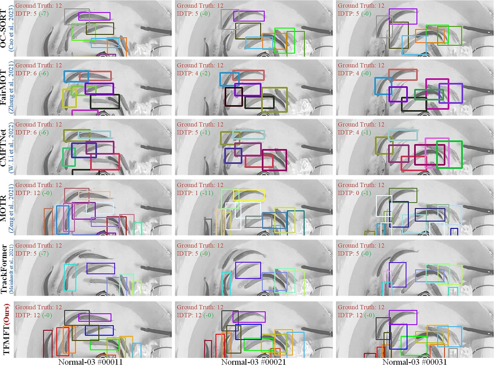

# TFMFT: Transformer-based Multiple Fish Tracking
The official implementation of the paper：
>  [**TFMFT: Transformer-based Multiple Fish Tracking**](https://doi.org/10.1016/j.compag.2023.108600)  
>  Weiran Li, Yeqiang Liu, Wenxu Wang, Zhenbo Li*, Jun Yue
>  [**\[Paper\]**](https://doi.org/10.1016/j.compag.2023.108600) [**\[Code\]**](https://github.com/vranlee/TFMFT/)


Contact: vranlee@cau.edu.cn. Any questions or discussion are welcome!

-----

## Updates
+ [2024.01.10] We have updated the sample official implementation.
+ [2023.08.31] We uploaded the abstract of the paper and resources. The full resources will be released soon.
-----

## Tracking Result Samples


## Abstract
Recent advancements in fish tracking methodologies provide valuable solutions for assessing fish growth, marine fisheries, and biological research. In particular, there has been a burgeoning interest in vision-based methods for fish tracking, owing to the enhanced computational capabilities facilitated by deep learning models. However, these methods face several challenges, including poor fish detection performance under complex backgrounds, the potential for identification switches caused by the non-rigid features and occlusions of fish, and the limited fault tolerance of extant approaches. In this paper, a transformer-based multiple fish tracking model (TFMFT) is proposed, specifically designed to address the issue of instance loss of fish targets in aquaculture ponds with complex background disturbance. In particular, we introduce a Multiple Association (MA) method that bolsters fault tolerance in tracking by synthesizing simple Intersection-over-Union matching in the identification (ID) matching module. Through empirical studies across diverse Transformer-based models, we comprehensively assessed the influence of architecture design on data requirements. Furthermore, to evaluate the performance and generalizability of fish tracking models, we present the Multiple_Fish_Tracking_2022 (MFT22) dataset. The results demonstrate that TFMFT achieves 30.6% IDF1 (Identification F-Score) on the MFT22 dataset, outperforming the state-of-the-art by 10.9% and showcasing superior performance over other models.

## Contributions
+ A transformer-based multiple fish tracking network is designed, termed TFMFT, specifically tailored to handle challenging scenarios like occlusions, poor illuminations, and deformations. The network enables unified training and real-time tracking on GPUs.
+ We propose a novel Multiple Association (MA) method to enhance detector adaptability and accommodate individuals with significant appearance variations. The MA module achieves maximum matching by iterative operating, enabling robust tracking even with deformation and appearance changes.
+ Experiments with diverse transformer architectures explored underlying principles. We identified a suitable training architecture demanding less data for effective training. Moreover, tracking result visualizations demonstrated efficacy across real-world conditions.
+ The experiments were conducted on the Multiple_Fish_Tracking_2022 (MFT22) dataset to evaluate the performance and generalizability of the proposed model. The results demonstrate that TFMFT outperforms other tracking networks, achieving an impressive 30.6% IDF1 (Identification F-Score).

## Tracking Performance

### Results on MFT22 Dataset

Dataset  | Paradigm | IDF1 ↑ | MOTA↑  |  IDP ↑  |  IDR ↑  |
---------|----------|--------|--------|---------|---------|
OC-SORT   | SDE |    17.9% |	26.5%	|42.3%	|11.4%   |
FairMOT   | JDE |    19.7% |	59.5%	|24.3%	|16.6%   |
CMFTNet   | JDE |    19.6% |	**61.5%**	|23.9%	|16.6%   |
TFMFT| Transformer | **30.6%**|	57.8%	|**55.6%**   |**25.1%**   |

### MFT22 Datasets
*The full dataset will be released soon. (We are preparing a large dataset for fish tracking, counting and behavior analysis, which will include the video segments of this research.)*


## Installation
+ **Step.1** Clone this repo.
+ **Step.2** Install dependencies. We use **python 3.10.4** and **CUDA 11.3**.
   ```
   cd {Repo_ROOT}
   conda create --TFMFT --file requirements.txt
   conda activate TFMFT
   ```

## Pretrained Model
Our pretrained **TFMFT** models can be downloaded here:   
+  **TFMFT.pth [[BaiduYun: vtry]](https://pan.baidu.com/s/1kGua3IY56IPp5Xb668RZOw?pwd=vtry)**  


## Exps.
* Download or utilize your training datasets.
* Train and Val shell in the experiments/demo.sh:
```
sh experiments/demo.sh
```

## Acknowledgement
A large part of the code is borrowed from [TransTrack](https://github.com/PeizeSun/TransTrack), [ByteTrack](https://github.com/ifzhang/ByteTrack), [Deformable DETR](https://github.com/fundamentalvision/Deformable-DETR).
Thanks for their wonderful works!

## Citation
```
@article{LI2024108600,
title = {TFMFT: Transformer-based multiple fish tracking},
journal = {Computers and Electronics in Agriculture},
volume = {217},
pages = {108600},
year = {2024},
issn = {0168-1699},
doi = {https://doi.org/10.1016/j.compag.2023.108600},
author = {Weiran Li and Yeqiang Liu and Wenxu Wang and Zhenbo Li and Jun Yue},
}
```

## Star History
[](https://star-history.com/#vranlee/TFMFT&Date)
