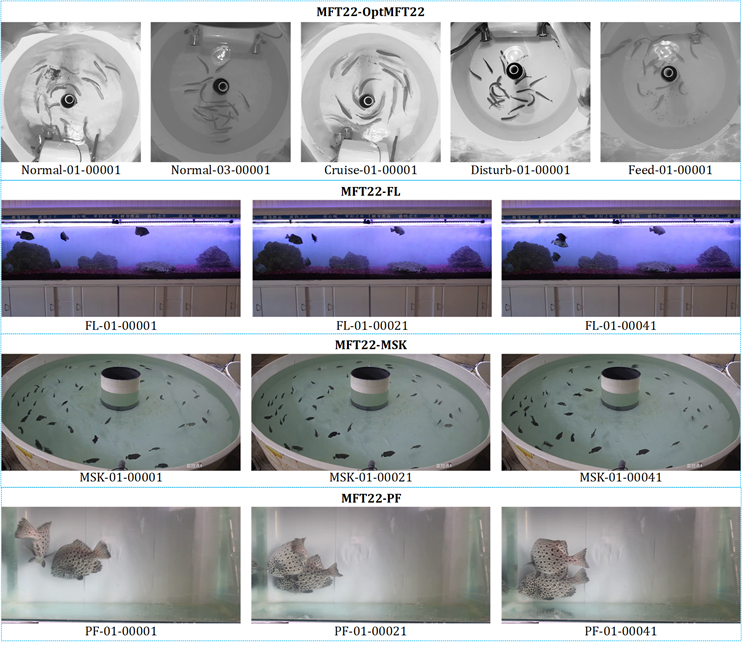

# TFMFT: Transformer-based Multiple Fish Tracking
The official implementation of the paper：
>  [**Transformer-based Multiple Fish Tracking**](###TODO###)  
>  Weiran Li, Zhenbo Li, et al.  
>  [**\[Paper\]**](###TODO###) [**\[Code\]**](https://github.com/vranlee/TFMFT/)

Contact: vranlee@cau.edu.cn. Any questions or discussion are welcome!

-----

## Updates
+ [2023.08.24] We uploaded the abstract of the paper and resources. The full resources will be released soon.
-----

## Tracking Result Samples

## Abstract
Fish tracking methods provide a valuable solution for fish growth assessment, marine fisheries, and biological research. Recently, there has been a growing interest in vision-based methods for fish tracking, thanks to the high-performance computing supported by deep learning models. However, these methods face several challenges, including poor fish detection performance under complex backgrounds, the potential for identification switches caused by the non-rigid features and occlusions of fish, and the limited fault tolerance of existing approaches. In this paper, a transformer-based multiple fish tracking model (TFMFT) is proposed, specifically designed to address the issue of instance loss of fish targets in aquaculture ponds with complex background disturbance. In particular, we introduce a Multiple Association (MA) method that enhances fault tolerance in tracking by combining simple Intersection-over-Union matching in the identification (ID) matching module. Through empirical studies on diverse Transformer-based models, we comprehensively assessed the influence of architecture design on data requirements. Besides, to evaluate the performance and generalizability of fish tracking models, we present the Multiple_Fish_Tracking_2022 (MFT22) dataset. The results demonstrate that TFMFT outperforms other models and achieves state-of-the-art performance on the MFT22 dataset, with 30.6% IDF1 (Identification F-Score).

## Contributions
+  A transformer-based multiple fish tracking network is designed, termed TFMFT, specifically tailored for handing challenging scenarios such as occlusions, poor illuminations, and deformations. The network allows unified training and real-time tracking on GPUs.
+  We propose a novel Multiple Association (MA) method to enhance the adaptability of high-precision detectors and accommodate individuals with significant appearance variations. The MA module achieves maximum matching by performing multiple iterative operations, which allows for robust tracking even in cases of individual deformation and appearance changes.
+  Experiments involving diverse transformer-based architectures were performed to explore underlying principles. Through this investigation, we identified a suitable training architecture that demands less data for effective training. Moreover, the visualizations of tracking results demonstrated its efficacy across various real-world conditions.
+  The experiments were conducted on the Multiple_Fish_Tracking_2022 (MFT22) dataset to evaluate the performance and generalizability of the proposed model. The results demonstrate that TFMFT outperforms other tracking networks, achieving an impressive 30.6% IDF1 (Identification F-Score).

## Tracking performance

### Results on MFT22 Dataset

Dataset  | Paradigm | IDF1 ↑ | MOTA↑  |  IDP ↑  |  IDR ↑  |
---------|----------|--------|--------|---------|---------|
OC-SORT   | SDE |    17.9% |	26.5%	|42.3%	|11.4%   |
FairMOT   | JDE |    19.7% |	59.5%	|24.3%	|16.6%   |
CMFTNet   | JDE |    19.6% |	**61.5%**	|23.9%	|16.6%   |
TFMFT| Transformer | **30.6%**|	57.8%	|**55.6%**   |**25.1%**   |

### MFT22 Datasets
***The full dataset will be released soon.***

